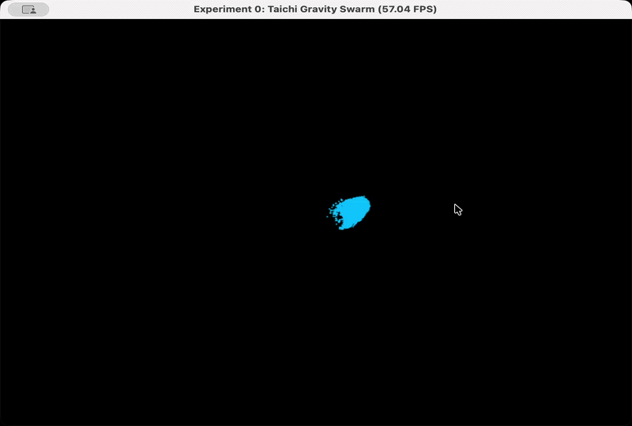

# Work0: 万有引力粒子群仿真

## 项目简介
本项目实现了一个基于 Python 和 Taichi 库的 GPU 加速粒子群物理模拟系统。通过并行的底层运算，流畅展示了万级数量的粒子在交互作用下的动态物理行为。

## 核心文件结构
代码采用模块化架构，逻辑与渲染严格分离：
- `config.py`：系统配置区。定义了粒子总数（10000）、引力强度、空气阻力、边界反弹损耗以及 GUI 渲染参数。
- `physics.py`：核心逻辑区。包含 Taichi 显存数据结构定义与 `@ti.kernel` 修饰的底层并行算子，完全交由 GPU 并行计算粒子的位置与速度矢量，不干预视图层。
- `main.py`：程序入口与视图层。负责初始化 Taichi GPU 环境、读取实时鼠标坐标，驱动物理内核更新，并执行 GUI 渲染主循环。

## 物理逻辑与实现功能
1. 动态引力交互：计算每个粒子与鼠标光标的方向和距离，当距离大于阈值时，粒子会持续受到指向鼠标的引力。
2. 阻力与边界碰撞：粒子在运动中会受到恒定的空气阻力衰减；当粒子触碰窗口边缘时，会触发位置重置与速度反弹，并计算能量损耗。
3. 高性能渲染：利用 Taichi 框架，实现了 10000 个粒子的高帧率实时物理模拟与屏幕绘制。

## 效果展示
