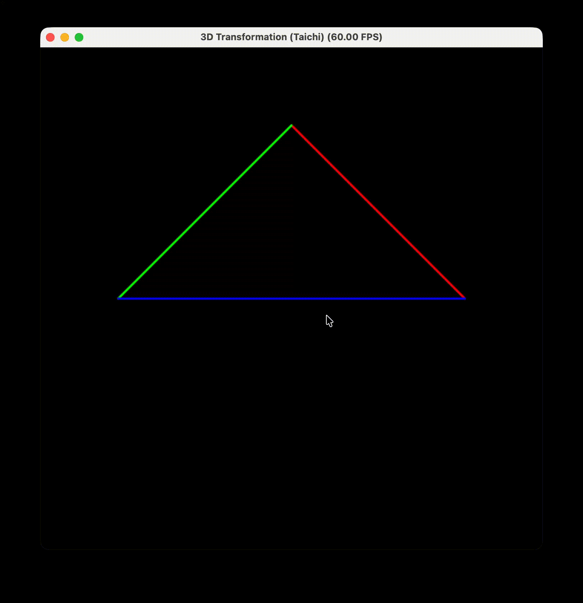

# Work1: 基础 3D 变换流水线 (MVP) 仿真

## 项目简介
本项目基于 Python 与 Taichi 高性能计算库，完整实现了计算机图形学中最核心的 **MVP 变换流水线**。通过手动构建 $4 \times 4$ 齐次坐标变换矩阵，程序将三维空间中的几何顶点经过旋转、平移和透视挤压，最终实时渲染至二维屏幕，模拟了真实的 3D 视觉观测过程。

## 核心文件结构
代码逻辑严密，实现了计算与渲染的有效结合：
- **变换逻辑区**：通过 `@ti.func` 定义了 `get_model_matrix`（模型旋转）、`get_view_matrix`（视图位移）以及 `get_projection_matrix`（透视投影）三个核心数学算子。
- **并行计算内核**：`compute_transform` 函数被标记为 `@ti.kernel`，利用 Taichi 的后端加速能力，在 GPU/CPU 上并行处理顶点变换、透视除法以及视口映射。
- **主循环与交互**：`main.py` 驱动 GUI 渲染并在每一帧捕获键盘事件（A/D 键），动态更新模型旋转角度。

## 物理逻辑与实现功能
1. **MVP 矩阵链条实现**：
    - **Model (模型变换)**：实现绕 Z 轴的旋转矩阵，利用三角函数 $\cos$ 与 $\sin$ 实时改变物体朝向。
    - **View (视图变换)**：遵循“相对运动”原理，将相机坐标系平移至世界坐标原点，确保渲染视角的正确性。
    - **Projection (透视投影)**：采用 **Persp $\to$ Ortho（透视转正交）** 策略，通过相似三角形原理进行平截头体挤压，实现“近大远小”的真实视觉效果。
2. **齐次坐标与透视除法**：利用 4D 向量的 $w$ 分量存储深度信息，并在变换后执行归一化，将顶点坐标从裁剪空间转换至标准设备坐标系 (NDC)。
3. **坐标系线性映射**：将 $[-1, 1]$ 范围的计算结果线性映射至屏幕像素坐标 $[0, 1]$，完成从数学空间到显示空间的跨越。

## 效果展示

*(注：在运行窗口中按下 'A' 或 'D' 键可控制三角形旋转，观察透视形变效果)*